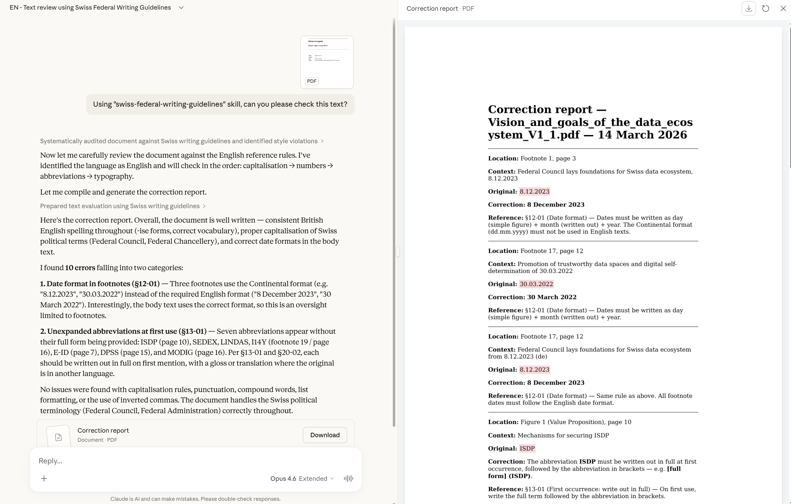
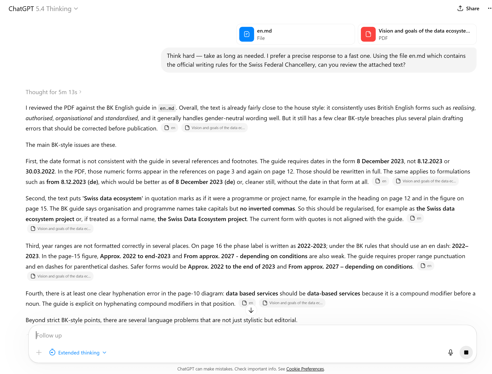
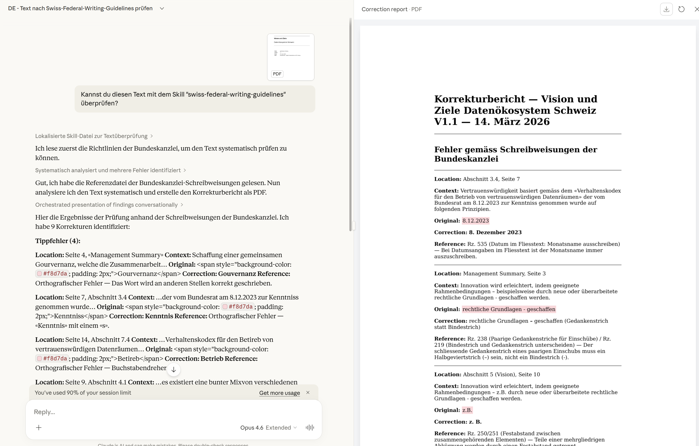
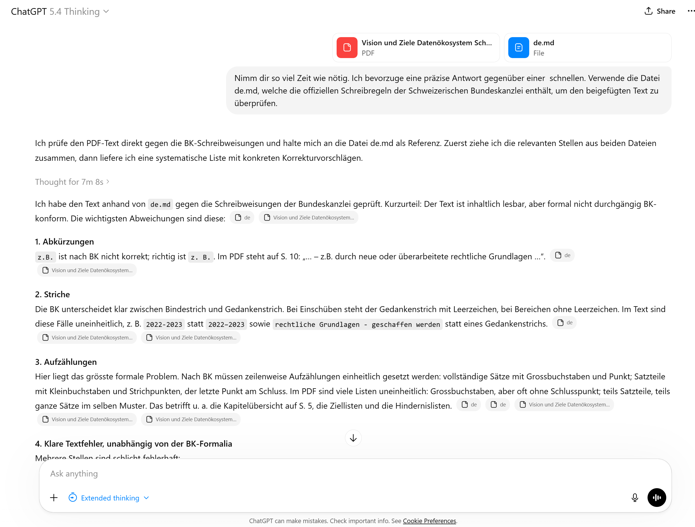
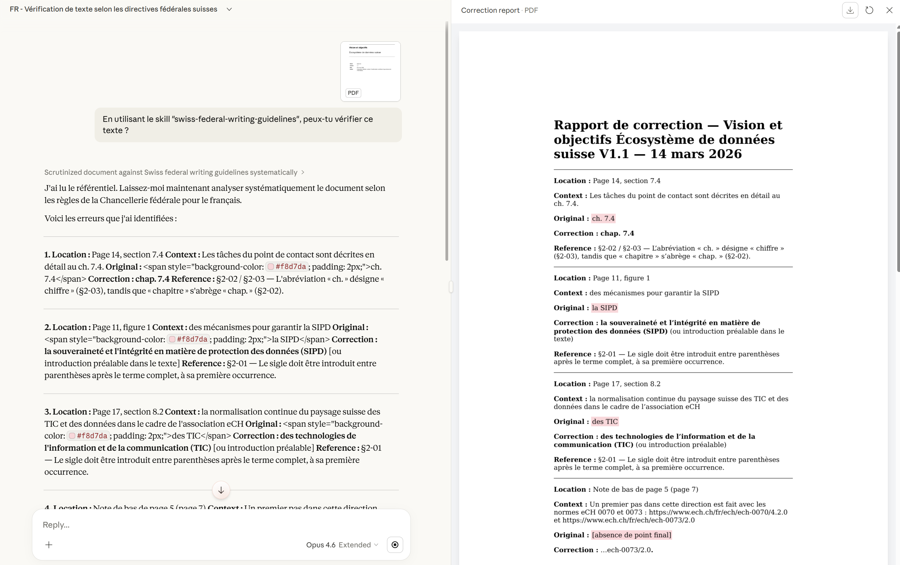
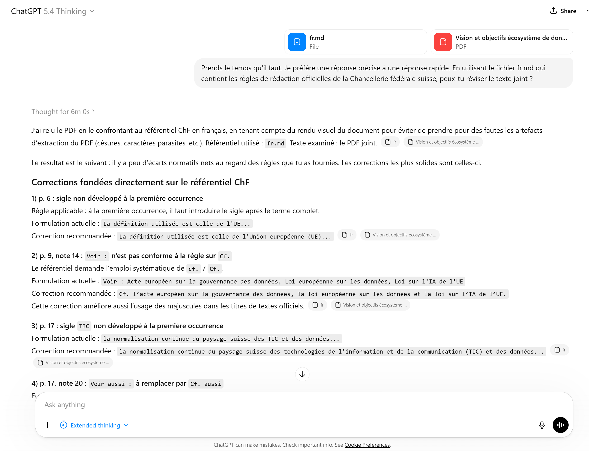
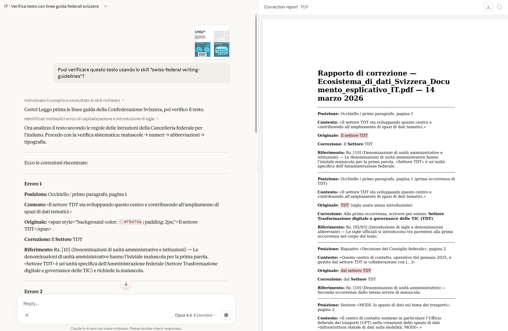
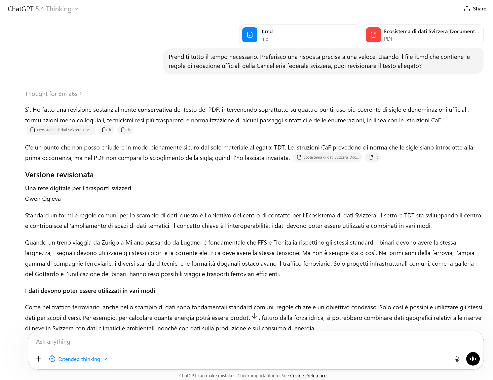

# Swiss Federal Writing Guidelines Skill - For AI Use

[English](#english) | [Deutsch](#deutsch) | [Français](#français) | [Italiano](#italiano)

---

## 🇬🇧 English

This repository provides a **Skill** for **Claude Code** (automatically loaded via `SKILL.md`) that enforces the official writing and typography directives of the Swiss Federal Chancellery. 

**Universal usage:** The files in the `references/` folder (`de.md`, `fr.md`, `it.md`, `en.md`) are standalone, machine-readable prompts. They can be copied and pasted into any AI chat interface (ChatGPT, Claude.ai, Gemini, etc.) to accurately correct or review official Swiss federal texts.

### 🚀 Key Features
- **Multilingual Support**: Full support for French, German, Italian, and English official writing styles.
- **Official Guidelines**: Based on the *Schreibweisungen* (DE), the *Instructions de la Chancellerie fédérale sur la présentation des textes* (FR), the *Istruzioni della Cancelleria federale per la redazione di testi ufficiali* (IT), and the *ELS Style Guide* (EN).
- **Justified Corrections**: Every flagged error is backed by a specific **Randziffer (Rz.)** or official rule reference.
- **AI-Optimized References**: The rules in `references/` are structured specifically for maximum precision with LLMs.
- **Automated Reporting**: Generates clear, structured correction reports in Markdown and PDF format.

### 📂 Project Structure
- `swiss-federal-writing-guidelines.skill`: Packaged skill for easy import into Claude.ai.
- `SKILL.md`: Core logic and system instructions for Claude Code.
- `references/`: AI-ready prompts and structured rules for each language.
- `sources/`: Original official PDFs and source documents for verification.
- `CLAUDE.md`: Technical documentation for project maintenance.

### 🚀 Usage
- **With Claude (Web Interface)**:
  1. Go to [claude.ai/customize/skills](https://claude.ai/customize/skills).
  2. Click **"+"**, then **"Upload a skill"**.
  3. Select the `swiss-federal-writing-guidelines.skill` file.
  4. In any chat, call the skill by typing: ``Using "swiss-federal-writing-guidelines" skill, can you please check this text?``
  5. [See image below](images/skill-claude_en.png)
- **With Claude Code (CLI)**: Simply keep `SKILL.md` in your project root; it loads automatically.
- **Other AI Tools (ChatGPT, Gemini, etc.)**:
  1. Upload the reference file for your language (e.g., `references/en.md`).
  2. Ask: *"Think hard — take as long as needed. I prefer a precise response to a fast one. Using the file en.md which contains the official writing rules for the Swiss Federal Chancellery, can you review the attached text?"*
  3. [See image below](images/web-chatgpt_en.png)

### 📄 License
**This repository is free to use and open to everyone.** 
The typographic and editorial rules contained in this repository are based on official publications of the **Swiss Federal Chancellery**. These rules and the source documents remain the intellectual property of the Swiss Confederation. This repository is provided to facilitate the correct application of these standards through AI tools.

---

## 🇩🇪 Deutsch

Dieses Repository bietet einen **Skill** für **Claude Code** (wird automatisch über `SKILL.md` geladen), der die offiziellen Schreib- und Typografierichtlinien der Schweizerischen Bundeskanzlei durchsetzt.

**Universelle Nutzung:** Die Dateien im Ordner `references/` (`de.md`, `fr.md`, `it.md`, `en.md`) sind eigenständige, maschinenlesbare Prompts. Sie können in jede KI-Chat-Schnittstelle (ChatGPT, Claude.ai, Gemini usw.) kopiert werden, um offizielle Schweizer Bundeskanzlei-Texte präzise zu korrigieren oder zu überprüfen.

### 🚀 Hauptmerkmale
- **Mehrsprachige Unterstützung**: Vollständige Unterstützung für die offiziellen Schreibstile in Französisch, Deutsch, Italienisch und Englisch.
- **Offizielle Richtlinien**: Basierend auf den *Schreibweisungen* (DE), den *Instructions de la Chancellerie fédérale sur la présentation des textes* (FR), den *Istruzioni della Cancelleria federale per la redazione di testi ufficiali* (IT) und dem *ELS Style Guide* (EN).
- **Begründete Korrekturen**: Jeder gemeldete Fehler wird durch eine spezifische **Randziffer (Rz.)** oder eine offizielle Regelreferenz belegt.
- **KI-optimierte Referenzen**: Die Regeln unter `references/` sind speziell für maximale Präzision mit LLMs strukturiert.
- **Automatische Berichterstattung**: Erstellt klare, strukturierte Korrekturberichte im Markdown- und PDF-Format.

### 📂 Projektstruktur
- `swiss-federal-writing-guidelines.skill`: Gepackter Skill zum einfachen Import in Claude.ai.
- `SKILL.md`: Kernlogik und Systemanweisungen für Claude Code.
- `references/`: KI-bereite Prompts und strukturierte Regeln für jede Sprache.
- `sources/`: Originale offizielle PDFs und Quelldokumente zur Überprüfung.
- `CLAUDE.md`: Technische Dokumentation für die Projektpflege.

### 🚀 Verwendung
- **Mit Claude (Weboberfläche)**:
  1. Gehen Sie zu [claude.ai/customize/skills](https://claude.ai/customize/skills).
  2. Klicken Sie auf **"+"**, dann auf **"Upload a skill"**.
  3. Wählen Sie die Datei `swiss-federal-writing-guidelines.skill` aus.
  4. In jedem Chat können Sie den Skill aufrufen mit: ``Kannst du diesen Text mit dem Skill "swiss-federal-writing-guidelines" überprüfen?``
  5. [Siehe Abbildung unten](images/skill-claude_de.png)
- **Mit Claude Code (CLI)**: Behalten Sie `SKILL.md` einfach im Stammverzeichnis; es wird automatisch geladen.
- **Andere KI-Tools (ChatGPT, Gemini usw.)**:
  1. Laden Sie die Referenzdatei für Ihre Sprache hoch (z. B. `references/de.md`).
  2. Fragen Sie: *"Nimm dir so viel Zeit wie nötig. Ich bevorzuge eine präzise Antwort gegenüber einer schnellen. Verwende die Datei de.md, welche die offiziellen Schreibregeln der Schweizerischen Bundeskanzlei enthält, um den beigefügten Text zu überprüfen."*
  3. [Siehe Abbildung unten](images/web-chatgpt_de.png)

### 📄 Lizenz
**Dieses Repository ist für alle frei und kostenlos nutzbar.** 
Die in diesem Repository enthaltenen Schreib- und Typografieregeln basieren auf offiziellen Publikationen der **Schweizerischen Bundeskanzlei**. Diese Regeln und die Quelldokumente bleiben geistiges Eigentum der Schweizerischen Eidgenossenschaft. Dieses Repository wird zur Verfügung gestellt, um die korrekte Anwendung dieser Standards durch KI-Tools zu erleichtern.

---

## 🇫🇷 Français

Ce dépôt propose une **compétence (Skill)** pour **Claude Code** (chargée automatiquement via `SKILL.md`) qui applique les directives officielles de rédaction et de typographie de la Chancellerie fédérale suisse.

**Utilisation universelle :** Les fichiers du dossier `references/` (`de.md`, `fr.md`, `it.md`, `en.md`) sont des prompts autonomes et structurés. Ils peuvent être copiés-collés dans n'importe quelle interface de chat IA (ChatGPT, Claude.ai, Gemini, etc.) pour corriger ou réviser avec précision des textes officiels de la Confédération.

### 🚀 Fonctionnalités
- **Support multilingue** : Prise en charge complète des styles rédactionnels officiels en français, allemand, italien et anglais.
- **Directives officielles** : Basé sur les *Schreibweisungen* (DE), les *Instructions de la Chancellerie fédérale sur la présentation des textes* (FR), les *Istruzioni della Cancelleria federale per la redazione di testi ufficiali* (IT) et le *ELS Style Guide* (EN).
- **Corrections justifiées** : Chaque erreur signalée est étayée par une **Randziffer (Rz.)** spécifique ou une référence officielle.
- **Références optimisées pour l'IA** : Les règles dans `references/` sont structurées pour une précision maximale avec les LLMs.
- **Rapports automatisés** : Génère des rapports de correction clairs et structurés aux formats Markdown et PDF.

### 📂 Structure du Projet
- `swiss-federal-writing-guidelines.skill` : Compétence groupée pour un import facile dans Claude.ai.
- `SKILL.md` : Logique centrale et instructions système pour Claude Code.
- `references/` : Prompts optimisés pour l'IA et règles structurées par langue.
- `sources/` : Documents PDF et sources officielles originales pour vérification.
- `CLAUDE.md` : Documentation technique pour la maintenance du projet.

### 🚀 Utilisation
- **Avec Claude (Interface Web)** :
  1. Allez sur [claude.ai/customize/skills](https://claude.ai/customize/skills).
  2. Cliquez sur **"+"**, puis sur **"Upload a skill"**.
  3. Sélectionnez le fichier `swiss-federal-writing-guidelines.skill`.
  4. Dans n'importe quel chat, appelez la compétence en tapant : ``En utilisant le skill "swiss-federal-writing-guidelines", peux-tu vérifier ce texte ?``
  5. [Voir l'image ci-dessous](images/skill-claude_fr.png)
- **Avec Claude Code (CLI)** : Gardez simplement `SKILL.md` à la racine ; il se charge automatiquement.
- **Autres outils IA (ChatGPT, Gemini, etc.)** :
  1. Téléversez le fichier de référence de la langue voulue (ex: `references/fr.md`).
  2. Demandez : *"Prends le temps qu'il faut. Je préfère une réponse précise à une réponse rapide. En utilisant le fichier fr.md qui contient les règles de rédaction officielles de la Chancellerie fédérale suisse, peux-tu réviser le texte joint ?"*
  3. [Voir l'image ci-dessous](images/web-chatgpt_fr.png)

### 📄 Licence
**L'utilisation de ce dépôt est libre et gratuite pour tous.** 
Les règles typographiques et rédactionnelles contenues dans ce dépôt sont basées sur les publications officielles de la **Chancellerie fédérale suisse**. Ces règles et les documents sources restent la propriété intellectuelle de la Confédération suisse. Ce dépôt est mis à disposition pour faciliter l'application correcte de ces normes via des outils d'IA.

---

## 🇮🇹 Italiano

Questo repository fornisce una **Skill** per **Claude Code** (caricata automaticamente tramite `SKILL.md`) che applica le direttive ufficiali di redazione e tipografia della Cancelleria federale svizzera.

**Utilizzo universale:** I file nella cartella `references/` (`de.md`, `fr.md`, `it.md`, `en.md`) sono prompt autonomi e leggibili dalle macchine. Possono essere copiati e incollati in qualsiasi interfaccia di chat IA (ChatGPT, Claude.ai, Gemini, ecc.) per correggere o revisionare con precisione i testi ufficiali della Confederazione Svizzera.

### 🚀 Caratteristiche
- **Supporto multilingue**: Supporto completo per gli stili di scrittura ufficiali in francese, tedesco, italiano e inglese.
- **Linee guida ufficiali**: Basate sulle *Schreibweisungen* (DE), sulle *Instructions de la Chancellerie fédérale sulla presentazione dei testi* (FR), sulle *Istruzioni della Cancelleria federale per la redazione di testi ufficiali* (IT) e sull'*ELS Style Guide* (EN).
- **Correzioni giustificate**: Ogni errore segnalato è supportato da una specifica **Randziffer (Rz.)** o da un riferimento ufficiale.
- **Riferimenti ottimizzati per l'IA**: Le regole in `references/` sono strutturate specificamente per la massima precisione con i LLMs.
- **Rapporti automatizzati**: Genera rapporti di correzione chiari e strutturati in formato Markdown e PDF.

### 📂 Struttura del Progetto
- `swiss-federal-writing-guidelines.skill`: Skill pacchettizzata per un facile import in Claude.ai.
- `SKILL.md`: Logica centrale e istruzioni di sistema per Claude Code.
- `references/`: Prompt pronti per l'IA e regole strutturate per ogni lingua.
- `sources/`: PDF ufficiali originali e documenti sorgente per la verifica.
- `CLAUDE.md`: Documentazione tecnica per la manutenzione del progetto.

### 🚀 Utilizzo
- **Con Claude (Interfaccia Web)**:
  1. Vai su [claude.ai/customize/skills](https://claude.ai/customize/skills).
  2. Fai clic su **"+"**, quindi su **"Upload a skill"**.
  3. Seleziona il file `swiss-federal-writing-guidelines.skill`.
  4. In qualsiasi chat, chiama la skill digitando: ``Puoi verificare questo testo usando lo skill "swiss-federal-writing-guidelines"?``
  5. [Vedi immagine sotto](images/skill-claude_it.png)
- **Con Claude Code (CLI)**: Basta tenere `SKILL.md` nella radice; si carica automaticamente.
- **Altri strumenti IA (ChatGPT, Gemini, ecc.)**:
  1. Carica il file di riferimento per la lingua desiderata (es. `references/it.md`).
  2. Chiedi: *"Prenditi tutto il tempo necessario. Preferisco una risposta precisa a una veloce. Usando il file it.md che contiene le regole di redazione ufficiali della Cancelleria federale svizzera, puoi revisionare il testo allegato?"*
  3. [Vedi immagine sotto](images/web-chatgpt_it.png)

### 📄 Licenza
**L'uso di questo repository è libero e gratuito per tutti.** 
Le regole tipografiche e redazionali contenute in questo repository si basano sulle pubblicazioni ufficiali della **Cancelleria federale svizzera**. Queste regole e i documenti sorgente rimangono proprietà intellettuale della Confederazione Svizzera. Questo repository è fornito per facilitare la corretta applicazione di questi standard attraverso strumenti di IA.

---
*Dernière mise à jour : 13 mars 2026*
